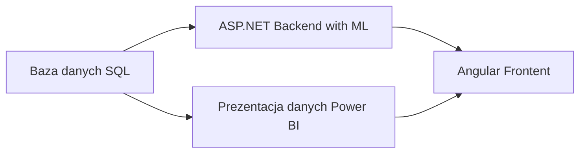

# Wykorzystanie technologii Big Data w chmurze Azure do przetwarzania i wizualizacji dużych zbiorów danych

Implementacja ćwiczenia `Big data analytics and visualization` robiona w ramach pracy inżynierskiej.

## Harmonogram

1. Do końca grudnia wykonać ćwiczenia z `Big data analytics and visualization` (zacząć od `Before HOL`)
2. Do końca grudnia wykonać ćwiczenia z `Microsoft Power BI Data Analyst`. Użyć przykładu AdventureWorks2020.
3. Zapoznać się z Azure DevOps i automatyzacją wysyłania rozwiązania do chmury.
4. Zapoznać się z DAX Studio i użyciem języka DAX w Power BI.
5. Do końca grudnia złożyć niezbędne dokumenty do pracy inżynierskiej
6. W styczniu być gotowym na przepytanie z dziedzin poruszanych w/w opisach:
   - użycie języka DAX w Power BI
   - użycie Verti Paq w Power BI

7. Wygenerować story - zaawansowaną motywację biznesową dla omawianych działań w projekcie

## Przybliżona struktura projektu

