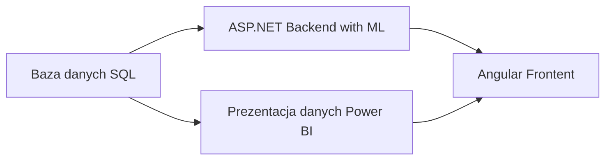

# Wykorzystanie technologii Big Data w chmurze Azure do przetwarzania i wizualizacji dużych zbiorów danych

Implementacja ćwiczenia `Big data analytics and visualization` robiona w ramach pracy inżynierskiej.

## Harmonogram

1. Przeczytać [Cloud Design Patterns](https://learn.microsoft.com/en-us/azure/architecture/patterns/)
2. Zapoznać się ze wzorcami architektonicznymi (event-driven, n warstw).
3. Do końca grudnia wykonać ćwiczenia z `Big data analytics and visualization` (zacząć od `Before HOL`)
4. Do końca grudnia wykonać ćwiczenia z `PL-300: Microsoft Power BI Data Analyst`. Użyć przykładu AdventureWorks2020.
5. Zapoznać się z `AZ-204: Developing Solutions for Microsoft Azure`.
6. Zapoznać się z `AZ-400: Designing and Implementing Microsoft DevOps Solutions`
7. Zapoznać się z `MS-600: Building Applications and Solutions with Microsoft 365 Core Services`
8. Zapoznać się z Azure DevOps i automatyzacją wysyłania rozwiązania do chmury.
9. Przejrzeć stronę www.sqlbi.com oraz zapoznać się z DAX Studio i użyciem języka DAX w Power BI.
10. Do końca grudnia złożyć niezbędne dokumenty do pracy inżynierskiej
11. W styczniu być gotowym na przepytanie z dziedzin poruszanych w/w opisach:

    - użycie języka DAX w Power BI
    - użycie Verti Paq w Power BI

12. Wygenerować story - zaawansowaną motywację biznesową dla omawianych działań w projekcie
13. Zapoznać się z konceptem hurtowni danych (Bill Inmon, Ralph Kimball)
14. [Web-Queue-Worker architecture style](https://learn.microsoft.com/en-us/azure/architecture/guide/architecture-styles/web-queue-worker)

## Przybliżona struktura projektu

